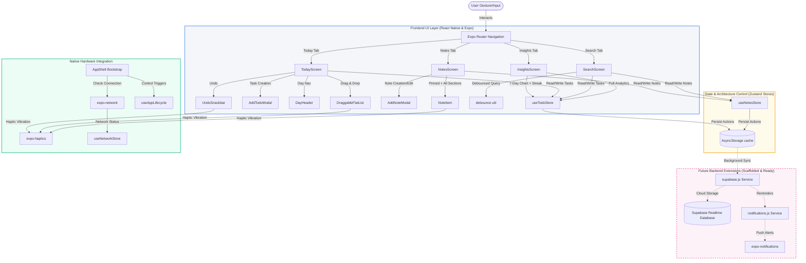

# 📱 Clarify

> **An offline-first, AI-ready task & note organizer built with React Native and Expo.**

---

[](https://reactnative.dev/)
[](https://expo.dev/)
[](https://github.com/pmndrs/zustand)
[](https://shopify.github.io/flash-list/)
[](https://github.com/Adinath-j/Clarify)
[](https://opensource.org/licenses/MIT)

---

## ⚡ Project Status

> [!NOTE]
> **All four core modules are now feature-complete and fully functional.** The Today, Notes, Insights, and Search tabs are all wired to live data stores with full CRUD, real-time search, and analytics. The cloud sync layer (Supabase) and push notifications service stubs are scaffolded and ready to activate with environment variables.

---

## 📖 About the Project

In a world cluttered with disconnected productivity utilities, **Clarify** bridges the gap. It is a premium, sleek workspace designed to combine your daily priorities, deep text notes, and intelligent self-reflections into a single, high-performance offline-first app.

### Why Clarify?
* **Zero Cognitive Overhead:** Plan your day, jot down thoughts, and view productivity patterns without leaving the application context.
* **Speed Above All:** Instantly interactive through aggressive offline caching and responsive local-first store architectures.
* **Tactile UX:** Embedded micro-interactions and native physical vibrations make checking off lists and prioritizing items deeply satisfying.
* **Privacy by Design:** Everything you do is saved locally on your device. Your data belongs entirely to you.

---

## 🎯 Features

### ✅ Today Tab
* 🔄 **Fluid Reordering:** Drag, drop, and sort active tasks with responsive gesture handling powered by `react-native-draggable-flatlist`.
* 📅 **Day-by-Day Navigation:** Step forward/backward through days using chevron arrows. A "Go to Today" badge appears when browsing past or future dates.
* 🏷️ **Full Category & Priority System:** Color-coded urgency flags (`high`, `medium`, `low`) and five task categories (`General`, `Work`, `Personal`, `Health`, `Learning`), each selectable when creating a task.
* 🔍 **Multi-Criteria Filter Chips:** Instantly filter tasks by any combination of priority and category. Drag-to-reorder automatically disables when filters are active.
* 🔙 **Instant Undo:** Accidentally swiped a task away? Bring it back with a single tap via the animated Undo Snackbar.
* 📭 **Contextual Empty States:** Smart empty state messages adapt based on whether you're viewing today or another date.

### 📝 Notes Tab
* ✍️ **Create & Edit Notes:** A bottom sheet modal with a title field and a multi-line body input. Tap any note card to jump back into edit mode.
* 📌 **Pin Important Notes:** Swipe left on any note to pin (or unpin) it. Pinned notes float to the top in their own dedicated section.
* 🗑️ **Swipe-to-Delete:** Swipe right on a note to delete it with haptic confirmation.
* ⏱️ **Relative Timestamps:** Each note card shows a human-readable "last edited" time (e.g., "Just now", "3h ago", "Yesterday").

### 📊 Insights Tab
* 📈 **Real Completion Rate:** Weekly completion percentage computed live from your actual task data — no hardcoded values.
* 📅 **Daily Activity Bar Chart:** 7-day bar chart showing completed tasks per day. Today's bar is highlighted in the brand blue.
* 🔥 **Consecutive Streak Counter:** Automatically tracks how many days in a row you've completed at least one task.
* ⚡ **Most Productive Day Detection:** Identifies and calls out your best day of the week.
* 🎯 **High-Priority Focus Card:** Shows your completion rate for `high` priority tasks specifically.
* ⏱️ **Focus Time Tab:** Toggle between Tasks and Focus Time views (Focus Time tracker coming in a future update).

### 🔎 Search Tab
* ⚡ **Real-Time Cross-Store Search:** A single search bar queries both your tasks and notes simultaneously with a 250ms debounce for smooth performance.
* 📋 **Section Results:** Results are grouped under clear "Tasks (N)" and "Notes (N)" section headers.
* 📊 **Idle Stat Pills:** When no query is entered, three stat pills show your total task count, note count, and completed task count at a glance.
* 🔍 **Smart Empty States:** Distinct prompts for "no results found" vs. the initial idle state.

---

## 🏛️ System Architecture



---

## 🛠️ Tech Stack

### Core Framework
* **React Native (v0.81.5)** — Premium cross-platform component architecture.
* **Expo SDK (v54.0.33)** — Universal app ecosystem with rich native API libraries.

### State & Navigation
* **Zustand (v5.0.11)** — Lightweight, atomic external React state controller. Stores: `useTodoStore`, `useNotesStore`, `useNetworkStore`, `useAuthStore`.
* **Expo Router (v6)** — File-system-based tab and stack routing with `src/app/` as the root directory.

### Native & Performance Enhancements
* **Shopify FlashList (v2.0.2)** — Recycled list viewport for ultra-fast list render and fluid scrolling.
* **React Native Draggable FlatList (v4.0.3)** — Fluid drag, drop, and auto-scrolling gesture controller.
* **React Native Gesture Handler (v2.28.0)** — Powers `Swipeable` delete/pin actions on Todo and Note cards.
* **React Native Reanimated (v4.1.1)** — 60 FPS UI thread animations including the Skeleton shimmer effect.
* **Expo Haptics (v15.0.8)** — Physical vibration engine firing on swipes, drags, and task completions.
* **Expo Network** — Periodic connection monitoring every 5 seconds via `useNetwork` hook.
* **AsyncStorage (v2.2.0)** — Offline-first persistence layer for all todos and notes.

### Future Integrations (Scaffolded)
* **Supabase** — Client-side database sync engine. The client and sync helpers are built; activate by adding env vars.
* **expo-notifications** — Full permission + scheduling service ready to wire up to the reminder feature.
* **Gemini Nano / Gemini API** — Planned local/cloud LLM provider for AI-powered weekly summaries and smart insights.

---

## 📂 Folder Structure

```
Clarify/
├── App.js                      # Fallback entry: GestureHandlerRootView wrapping AppShell
├── app.json                    # Expo build config & expo-router plugin declaration
├── index.js                    # Native entry point (registerRootComponent)
├── babel.config.js             # Babel config with Reanimated plugin
├── package.json                # Dependencies & npm scripts
├── assets/                     # Static resources (icons, splash screens)
└── src/
     ├── AppShell.js            # Bootstrap: hydrates all stores, starts network & lifecycle hooks
     ├── app/                   # Expo Router file-system directory
     │    ├── _layout.js        # Tab bar layout, icons, and active tint configuration
     │    ├── index.js          # → TodayScreen
     │    ├── notes.js          # → NotesScreen
     │    ├── insights.js       # → InsightsScreen
     │    └── search.js         # → SearchScreen
     ├── components/
     │    ├── AddTodoModal.js   # Bottom sheet: title, priority chips, category selector
     │    ├── AddNoteModal.js   # Bottom sheet: title + multiline body for notes
     │    ├── DayHeader.js      # Date display with ◀ ▶ day navigation & "Go to Today" badge
     │    ├── FilterChips.js    # Horizontal pill filters for priority & category
     │    ├── FloatingActionButton.js  # Haptic-enabled FAB
     │    ├── NoteItem.js       # Swipeable note card (right=delete, left=pin, timestamps)
     │    ├── TodoItem.js       # Swipeable task row (priority color, checkbox, drag handle)
     │    ├── UndoSnackbar.js   # Timed undo toast after task deletion
     │    ├── Skeleton.js       # Animated shimmer placeholder (pulsing opacity loop)
     │    ├── TodoSkeleton.js   # Task row shimmer layout
     │    ├── NoteSkeleton.js   # Note card shimmer layout
     │    └── InsightsSkeleton.js  # Insights card shimmer layout
     ├── hooks/
     │    ├── useAppLifecycle.js   # Responds to foreground/background AppState changes
     │    └── useNetwork.js        # Polls network status every 5s → networkStore
     ├── screens/
     │    ├── TodayScreen.js    # Drag-sort checklist with day nav, filters, undo, empty states
     │    ├── NotesScreen.js    # Pinned/all sections, add/edit modal, swipeable cards
     │    ├── InsightsScreen.js # Live 7-day analytics: rate, chart, streak, highlights
     │    └── SearchScreen.js   # Debounced cross-store search with stat pills
     ├── services/
     │    ├── supabase.js       # Guarded Supabase client + syncTodos/Notes/fetchFromCloud helpers
     │    └── notifications.js  # Permission request, scheduleTaskReminder, cancelReminder
     ├── store/
     │    ├── todoStore.js      # add, toggle, delete, reorderTodos, undo, persist
     │    ├── notesStore.js     # add, edit, togglePin, delete, persist
     │    ├── authStore.js      # user, isLoggedIn, setUser, hydrate, logout
     │    ├── networkStore.js   # isOnline flag updated by useNetwork hook
     │    └── uiStore.js        # Global UI loading state
     └── utils/
          ├── constants.js      # PRIORITIES, CATEGORIES, COLORS, STORAGE_KEYS, FILTER_CHIPS
          ├── date.js           # getDateKey, getDayLabel, getFullDate helpers
          ├── storage.js        # AsyncStorage save/load wrappers
          └── debounce.js       # debounce(fn, delay) with .cancel() — used by SearchScreen
```

---

## 🚀 Installation & Local Development

### Prerequisites
Make sure you have [Node.js (LTS)](https://nodejs.org/) installed and optionally:
* **iOS:** [Xcode](https://developer.apple.com/xcode/) (for running on iOS Simulator)
* **Android:** [Android Studio](https://developer.android.com/studio) (for running on Android Emulator)
* **Physical Device:** The [Expo Go app](https://expo.dev/expo-go) installed on your iOS/Android smartphone.

### Step 1: Clone & Navigate
```bash
git clone https://github.com/Adinath-j/Clarify.git
cd Clarify
```

### Step 2: Install Dependencies
```bash
npm install
```

### Step 3: Start the Development Server
```bash
npx expo start
```

### Step 4: Run the Application
When the terminal CLI loads, you can choose where to boot the application:
* Press **`a`** to open on your **Android Emulator**.
* Press **`i`** to open on your **iOS Simulator**.
* Scan the **QR Code** on your screen with your smartphone camera (iOS) or the Expo Go App (Android) to load Clarify instantly on your physical device.

---

## 🔒 Environment Variables

By default, Clarify operates entirely local-first and requires **no credentials to run**. When you're ready to activate cloud sync and push notifications, create a `.env` file in the project root:

```env
# Supabase — Cloud Sync (optional)
EXPO_PUBLIC_SUPABASE_URL=https://your-project.supabase.co
EXPO_PUBLIC_SUPABASE_ANON_KEY=your-anon-key
```

The app will automatically detect these variables and initialise the Supabase client. Without them, it runs silently in offline mode.

---

## 🗺️ Roadmap

- [x] Responsive layout with file-system routing (Expo Router)
- [x] Local-first persistent storage (`AsyncStorage` + Zustand)
- [x] Smooth gesture-controlled task dragging and sorting
- [x] Multi-criteria category and priority filtering chips
- [x] Tactile hardware responses (`expo-haptics`)
- [x] **Full Notes module** — create, edit, pin, swipe-delete with AddNoteModal
- [x] **Day navigation** — ◀ ▶ arrows to browse any past or future date
- [x] **Real-time Search** — debounced cross-store query across todos and notes
- [x] **Live Insights Dashboard** — 7-day completion rate, bar chart, streak, best day
- [x] **Category system** — 5 categories (General, Work, Personal, Health, Learning)
- [x] **Shimmer skeleton loaders** — animated pulse on all loading states
- [x] **Cloud sync service scaffold** — Supabase helpers ready to activate
- [x] **Notifications service scaffold** — expo-notifications stubs ready to wire up
- [ ] **Supabase Sync** — Real-time cloud database backup for cross-device sync
- [ ] **Focus Time Tracker** — Pomodoro-style session timer integrated into Insights
- [ ] **On-Device AI (Gemini Nano)** — Summarize weekly tasks & notes into smart insights
- [ ] **Collaborative Sharing** — Shared boards and notes via secure links
- [ ] **Production Launch** — Apple App Store & Google Play Store distribution

---

## 🤝 Contributing

Contributions are what make the open source community such an amazing place to learn, inspire, and create. Any contributions you make are **greatly appreciated**.

1. **Fork** the Project
2. Create your **Feature Branch** (`git checkout -b feature/AmazingFeature`)
3. **Commit** your Changes (`git commit -m 'Add some AmazingFeature'`)
4. **Push** to the Branch (`git push origin feature/AmazingFeature`)
5. Open a **Pull Request**

---

## 📄 License

Distributed under the MIT License. See `LICENSE` for more information.

---

## 📞 Contact

* **GitHub:** [@Adinath-j](https://github.com/Adinath-j)
* **Project Link:** [https://github.com/Adinath-j/Clarify](https://github.com/Adinath-j/Clarify)
