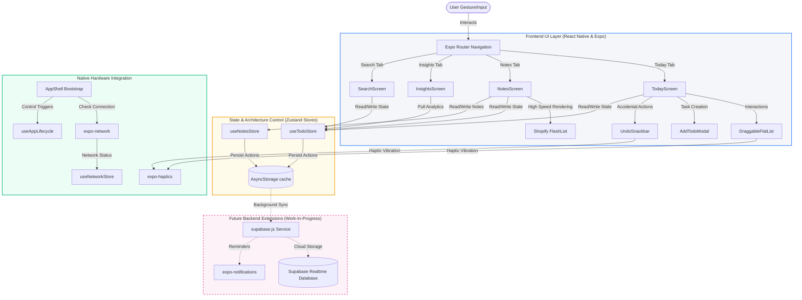

# 📱 Clarify

> **An offline-first, AI-ready task & note organizer built with React Native and Expo.**

---

[](https://reactnative.dev/)
[](https://expo.dev/)
[](https://github.com/pmndrs/zustand)
[](https://shopify.github.io/flash-list/)
[](https://github.com/Adinath-j/Clarify)
[](https://opensource.org/licenses/MIT)

---

## ⚡ Project Status Update
> [!IMPORTANT]
> **Clarify is under active, rapid development!** We are fine-tuning our features, preparing remote cloud synchronization engines, and preparing for an official public release. The project will come to **production deployment very soon on the Apple App Store and Google Play Store**. Stay tuned!

---

## 📖 About the Project
In a world cluttered with disconnected productivity utilities, **Clarify** bridges the gap. It is a premium, sleek workspace designed to combine your daily priorities, deep text notes, and intelligent self-reflections into a single, high-performance offline-first app. 

### Why Clarify?
* **Zero Cognitive Overhead:** Plan your day, jot down thoughts, and view productivity patterns without leaving the application context.
* **Speed Above All:** Instantly interactive through aggressive offline caching and responsive local-first store architectures.
* **Tactile UX:** Embedded micro-interactions and native physical vibrations make checking off lists and prioritizing items satisfying.
* **Privacy by Design:** Everything you do is saved locally on your device. Your data belongs entirely to you.

---

## 🎯 Features

* 🔄 **Fluid Reordering:** Drag, drop, and sort active tasks with responsive gesture handling powered by `react-native-draggable-flatlist`.
* 📅 **Day-by-Day Focus:** Quickly filter and navigate between daily task sheets. Look back at past completions or prepare future plans.
* 🏷️ **Categorized Priorities:** Color-coded urgency flags (`high`, `medium`, `low`) and custom task labels (e.g. *Work*, *Personal*, *Health*).
* 📝 **High-Speed Rich Notes:** Light, beautiful, pin-able text cards rendered instantly using Shopify's industry-leading `FlashList`.
* 📊 **Smart Productivity Dashboard:** Weekly completion statistics, interactive daily completion charts, and highlighted streaks.
* 💾 **Offline-First Storage:** Local-cache persistence that saves all tasks and notes instantly to storage.
* 🌐 **Network Resilient:** Automatic detection of connection drops with a polling network check hook.
* 🔙 **Instant Undo:** Accidentally swiped a task away? Bring it back with a single tap via the Undo Snackbar.

---

## 🏛️ System Architecture



---

## 🛠️ Tech Stack

### Core Core Framework
* **React Native (v0.81.5)** — Premium cross-platform component architecture.
* **Expo SDK (v54.0.33)** — Universal app ecosystem with rich native API libraries.

### State & Navigation
* **Zustand (v5.0.11)** — Lightweight, atomic, external React state controller.
* **Expo Router (v6)** — Type-safe, file-system-based tab and stack routing.

### Native & Performance Enhancements
* **Shopify FlashList (v2.0.2)** — Recycled list viewport for ultra-fast list render and fluid scrolling.
* **React Native Draggable FlatList (v4.0.3)** — Fluid drag, drop, and auto-scrolling gesture controller.
* **React Native Reanimated (v4.1.1)** — 60 FPS UI thread animations.
* **Expo Haptics (v15.0.8)** — Physical physical vibration engine triggers on drag and swipe.
* **Expo Network & Devices** — Periodic connection monitoring and hardware attributes collection.

### Future Integrations
* **Supabase** — Client-side database sync engine (work-in-progress).
* **Gemini Nano / Gemini API** — Planned local/cloud LLM provider for productivity summarizations and automated reflection highlights.

---

## 📂 Folder Structure

```
Clarify/
├── App.js                     # Root entry point initializing GestureHandler & rendering AppShell
├── app.json                   # Expo build configurations & declared router plugin schemes
├── index.js                   # Entry point register for native/Expo Go environments
├── babel.config.js            # Babel configuration containing the Reanimated plugin
├── package.json               # Package declarations, dependencies, and build commands
├── assets/                    # Static resources (icons, splash screens, logos)
└── src/
     ├── AppShell.js           # App bootstrap layer: hydrates state stores & loads environment
     ├── app/                  # File-system router directory
     │    ├── _layout.js       # App Tab bar controller and styling settings
     │    ├── index.js         # Entry route forwarding to the Today tab
     │    ├── notes.js         # Entry route forwarding to the Notes tab
     │    ├── insights.js      # Entry route forwarding to the Insights tab
     │    └── search.js        # Entry route forwarding to the Search tab
     ├── components/           # Modular reusable visual components
     │    ├── AddTodoModal.js  # Popup screen containing category, priority, and text inputs
     │    ├── DayHeader.js     # Horizontal daily navigation slider
     │    ├── FilterChips.js   # Fast toggle pills to sort/filter active lists
     │    ├── FloatingActionButton.js # Generic add-action button
     │    ├── InsightsSkeleton.js # Premium loader screen for statistics cards
     │    ├── TodoItem.js      # Task rows supporting swipes, dragging, and priority colors
     │    ├── UndoSnackbar.js  # Action toast showing active timer and restore trigger
     │    └── ...              # Other skeletal loader and list items
     ├── hooks/                # Native listener listeners
     │    ├── useAppLifecycle.js # Reacts to active/background system state events
     │    └── useNetwork.js     # Monitors online connectivity every 5 seconds
     ├── screens/              # Core screen container files
     │    ├── TodayScreen.js   # Handles main checklist: sorting, prioritizing, and deleting
     │    ├── NotesScreen.js   # Contains pinned and sorted note-taking lists
     │    ├── InsightsScreen.js # Aggregates tasks, focus times, and generates highlight cards
     │    └── SearchScreen.js  # Real-time search index for text filters
     ├── services/             # API Connectors
     │    ├── supabase.js      # Remote cloud synchronization service (planned extension)
     │    └── notifications.js # Pushes and triggers reminders (planned extension)
     ├── store/                # Centralized state management
     │    ├── todoStore.js     # Manages task additions, edits, deletions, and persistence
     │    ├── notesStore.js    # Manages rich text notes state
     │    ├── networkStore.js  # Manages global connection statuses
     │    └── uiStore.js       # Manages theme configurations
     └── utils/                # Utility helpers
          ├── date.js          # Compact date formatters and keys conversion
          ├── storage.js       # Storage wrappers for AsyncStorage saves/loads
          └── debounce.js      # High-performance search debounce mechanisms
```

---

## 🚀 Installation & Local Development

To spin up Clarify in your local development environment:

### Prerequisites
Make sure you have [Node.js (LTS)](https://nodejs.org/) installed and optionally:
* **iOS:** [Xcode](https://developer.apple.com/xcode/) (for running on iOS Simulator)
* **Android:** [Android Studio](https://developer.android.com/studio) (for running on Android Emulator)
* **Physical Device:** The [Expo Go app](https://expo.dev/expo-go) installed on your iOS/Android smartphone.

### Step 1: Clone & Navigate
```bash
git clone https://github.com/Adinath-j/Clarify.git
cd Clarify
```

### Step 2: Install Dependencies
```bash
npm install
```

### Step 3: Start the Development Server
```bash
npx expo start
```

### Step 4: Run the Application
When the terminal CLI loads, you can choose where to boot the application:
* Press **`a`** to open on your **Android Emulator**.
* Press **`i`** to open on your **iOS Simulator**.
* Scan the **QR Code** on your screen with your smartphone camera (iOS) or the Expo Go App (Android) to load Clarify instantly on your physical device.

---

## 🔒 Environment Variables

By default, Clarify operates entirely local-first and does not require cloud credentials. Once sync capabilities are launched, you can create a `.env` file in the root directory to activate backend integration:

```env
# Supabase Configuration
EXPO_PUBLIC_SUPABASE_URL=your_supabase_url
EXPO_PUBLIC_SUPABASE_ANON_KEY=your_supabase_anon_key

# Push Notifications Service
EXPO_PUBLIC_NOTIFICATIONS_ENDPOINT=your_server_endpoint
```

---

## 🗺️ Roadmap & Planned Upgrades

- [x] Responsive layout with file-system routing (Expo Router)
- [x] Local-first persistent memory architecture (`AsyncStorage` + Zustand)
- [x] Smooth gesture-controlled item dragging and sorting (`react-native-draggable-flatlist`)
- [x] Multi-criteria category and priority filtering chips
- [x] Tactile hardware responses (`expo-haptics`)
- [ ] **Supabase Sync** — Real-time remote cloud database backup for seamless cross-device synchronization.
- [ ] **On-Device LLM (Gemini Nano)** — Automatically summarize weekly notes and task completions into smart, personalized, actionable insights.
- [ ] **Collaborative Sharing** — Allow joint boards and notes shared via secure links.
- [ ] **Production Launch** — Distribute builds directly to Apple App Store and Google Play Store.

---

## 🤝 Contributing

Contributions are what make the open source community such an amazing place to learn, inspire, and create. Any contributions you make are **greatly appreciated**.

1. **Fork** the Project
2. Create your **Feature Branch** (`git checkout -b feature/AmazingFeature`)
3. **Commit** your Changes (`git commit -m 'Add some AmazingFeature'`)
4. **Push** to the Branch (`git push origin feature/AmazingFeature`)
5. Open a **Pull Request**

---

## 📄 License

Distributed under the MIT License. See `LICENSE` for more information.

---

## 📞 Contact

* **GitHub:** [@Adinath-j](https://github.com/Adinath-j)
* **Project Link:** [https://github.com/Adinath-j/Clarify](https://github.com/Adinath-j/Clarify)
